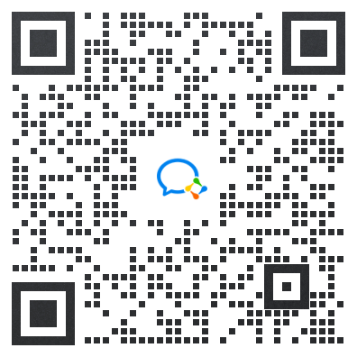

# PowerWeChat SDK

[](https://github.com/ArtisanCloud/PowerWeChat/actions/workflows/go-build.yml)
[](https://github.com/ArtisanCloud/PowerWeChat/actions/workflows/go-test.yml)

PowerWeChat是一款基于Golang的微信SDK开发框架。目前已经覆盖了微信小程序、企业微信、微信支付等绝大部分场景的API。

PowerWeChat致力于减少微信开发中的各种上手难度，使用者只需要关心API使用，不需要关注底层微信开发中需要用到各种AES加密和解密、签名以及验证，回调通知加解密等。

## 产品特性

* 简易上手，安装一次，全覆盖微信功能接口
* 开源项目，丰富的文档内容，长期维护
* 大部分接口已经支持强类型覆盖
* 完整的测试项目，支持Web API测试

## 快速上手

```bash
go get -u github.com/ArtisanCloud/PowerWeChat/v2
```

示范：初始化实例对象，调用小程序的授权登陆接口

```go
import (
"github.com/ArtisanCloud/PowerWeChat/v2/src/miniProgram"
"os"
)

// 1. 初始化小程序应用实例
app, err := miniProgram.NewMiniProgram(&miniProgram.UserConfig{
	AppID:  os.Getenv("miniprogram_app_id"), // 小程序、公众号或者企业微信的appid
	Secret: os.Getenv("miniprogram_secret"), // 商户号 appID
	HttpDebug: true,
	Debug:     false,
})

// 2. 调用小程序的授权登陆接口
code := "CODE" // 前端小程序登录时，从微信获取的code
rs, err := app.Auth.Session(code)

printf(rs.OpenID)
```

更多实例接口，请打开[官方文档](https://powerwechat.artisan-cloud.com/zh/start/)

## 文档以及使用示例

* [官网文档](https://powerwechat.artisan-cloud.com/zh/start/) ：全面的接口文档，方便用户查找，使用我们开发的sdk功能
* [使用示例](https://github.com/ArtisanCloud/power-wechat-tutorial) ：您可以通过Tutorial来了解到PowerWeChat的配置和使用

### API快速导航

* 公众号
	* [入门](https://powerwechat.artisan-cloud.com/zh/official-account/index.html)
	* [基础接口](https://powerwechat.artisan-cloud.com/zh/official-account/base.html)
	* [服务端](https://powerwechat.artisan-cloud.com/zh/official-account/server.html)
	* [消息](https://powerwechat.artisan-cloud.com/zh/official-account/messages.html)
	* [多客服消息转发](https://powerwechat.artisan-cloud.com/zh/official-account/message-transfer.html)
	* [消息群发](https://powerwechat.artisan-cloud.com/zh/official-account/broadcasting.html)
	* [用户](https://powerwechat.artisan-cloud.com/zh/official-account/user.html)
	* [用户标签](https://powerwechat.artisan-cloud.com/zh/official-account/user-tag.html)
	* [网页授权](https://powerwechat.artisan-cloud.com/zh/official-account/oauth.html)
	* [JSSDK](https://powerwechat.artisan-cloud.com/zh/official-account/jssdk.html)
	* [二维码](https://powerwechat.artisan-cloud.com/zh/official-account/qrcode.html)
	* [短Key托管](https://powerwechat.artisan-cloud.com/zh/official-account/shorten.html)
	* [临时素材](https://powerwechat.artisan-cloud.com/zh/official-account/media.html)
	* [素材管理](https://powerwechat.artisan-cloud.com/zh/official-account/material.html)
	* [菜单](https://powerwechat.artisan-cloud.com/zh/official-account/menu.html)
	* [卡券 ](https://powerwechat.artisan-cloud.com/zh/official-account/card.html)
	* [客服](https://powerwechat.artisan-cloud.com/zh/official-account/customer-service.html)
	* [摇一摇周边](https://powerwechat.artisan-cloud.com/zh/official-account/shake-around.html)
	* [数据统计](https://powerwechat.artisan-cloud.com/zh/official-account/data-cube.html)
	* [自动回复](https://powerwechat.artisan-cloud.com/zh/official-account/reply.html)
	* [评论数据管理](https://powerwechat.artisan-cloud.com/zh/official-account/comment.html)
	* [返佣商品](https://powerwechat.artisan-cloud.com/zh/official-account/goods.html)

* 小程序
	* [用户信息](https://powerwechat.artisan-cloud.com/zh/mini-program/user-info.html)
	* [数据统计与分析](https://powerwechat.artisan-cloud.com/zh/mini-program/statistics.html)
	* [客服消息](https://powerwechat.artisan-cloud.com/zh/mini-program/service-message.html)
	* [统一服务消息](https://powerwechat.artisan-cloud.com/zh/mini-program/uniform-message.html)
	* [动态消息](https://powerwechat.artisan-cloud.com/zh/mini-program/updatable-message.html)
	* [插件管理](https://powerwechat.artisan-cloud.com/zh/mini-program/plugin.html)
	* [小程序码](https://powerwechat.artisan-cloud.com/zh/mini-program/miniprogram-code.html)
	* [消息解密](https://powerwechat.artisan-cloud.com/zh/mini-program/decode-message.html)
	* [内容安全](https://powerwechat.artisan-cloud.com/zh/mini-program/content-security.html)
	* [生物认证](https://powerwechat.artisan-cloud.com/zh/mini-program/verify-signature.html)
	* [附近的小程序](https://powerwechat.artisan-cloud.com/zh/mini-program/nearby-miniprogram.html)
	* [订阅消息](https://powerwechat.artisan-cloud.com/zh/mini-program/subscription-message.html)
	* [服务市场](https://powerwechat.artisan-cloud.com/zh/mini-program/service-market.html)
	* [直播](https://powerwechat.artisan-cloud.com/zh/mini-program/live.html)
	* [安全风控](https://powerwechat.artisan-cloud.com/zh/mini-program/risk-control.html)
	* [URL Scheme](https://powerwechat.artisan-cloud.com/zh/mini-program/url-scheme.html)
* 微信支付
	* [入门](https://powerwechat.artisan-cloud.com/zh/payment/)
	* [订单](https://powerwechat.artisan-cloud.com/zh/payment/order.html)
	* [退款](https://powerwechat.artisan-cloud.com/zh/payment/refund.html)
	* [对账单](https://powerwechat.artisan-cloud.com/zh/payment/bill.html)
	* [通知](https://powerwechat.artisan-cloud.com/zh/payment/notification.html)
	* [红包](https://powerwechat.artisan-cloud.com/zh/payment/red-pack.html)
	* [JSSDK](https://powerwechat.artisan-cloud.com/zh/payment/jssdk.html)
	* [企业付款](https://powerwechat.artisan-cloud.com/zh/payment/work-pay.html)
	* [撤销订单](https://powerwechat.artisan-cloud.com/zh/payment/retrieve-order.html)
	* [分账](https://powerwechat.artisan-cloud.com/zh/payment/profit-share.html)
* 企业微信
	* [服务端](https://powerwechat.artisan-cloud.com/zh/wecom/server.html)
	* [应用管理](https://powerwechat.artisan-cloud.com/zh/wecom/agent.html)
	* [消息发送](https://powerwechat.artisan-cloud.com/zh/wecom/message.html)
	* [通讯录](https://powerwechat.artisan-cloud.com/zh/wecom/contacts.html)
	* [网页授权](https://powerwechat.artisan-cloud.com/zh/wecom/web-auth.html)
	* [客户联系](https://powerwechat.artisan-cloud.com/zh/wecom/external-contact.html)
	* [微信客服](https://powerwechat.artisan-cloud.com/zh/wecom/customer-service.html)
	* [临时素材](https://powerwechat.artisan-cloud.com/zh/wecom/media.html)
	* [OA](https://powerwechat.artisan-cloud.com/zh/wecom/oa.html)
	* [会话内容存档](https://powerwechat.artisan-cloud.com/zh/wecom/session.html)
	* [电子发票](https://powerwechat.artisan-cloud.com/zh/wecom/e-invoice.html)
	* [小程序](https://powerwechat.artisan-cloud.com/zh/wecom/mini-program.html)
	* [JSSDK](https://powerwechat.artisan-cloud.com/zh/wecom/jssdk.html)
	* [群机器人](https://powerwechat.artisan-cloud.com/zh/wecom/robot.html)
	* [移动端](https://powerwechat.artisan-cloud.com/zh/wecom/mobile.html)

更多内容请在[官方文档](https://powerwechat.artisan-cloud.com/zh/start/) 里面进行查阅。

## 联系我们

如果有任何意见，欢迎在Github Issue上提供意见反馈。同时，也欢迎扫描下方二维码加入企业微信讨论群。



